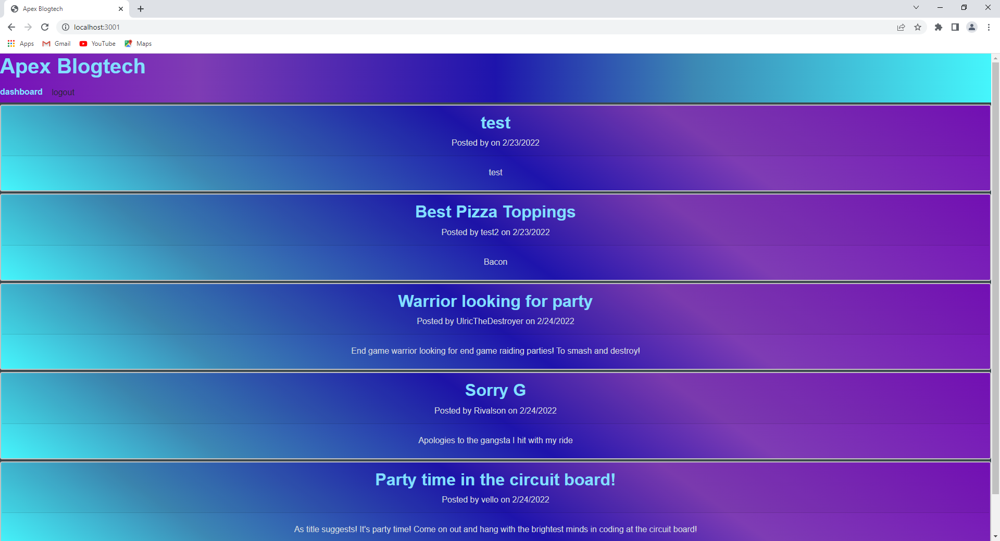
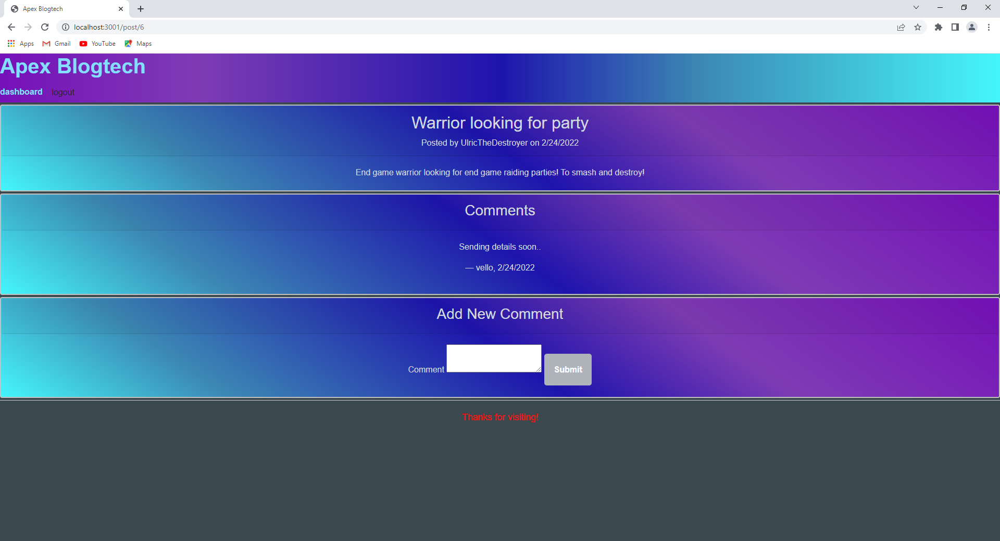
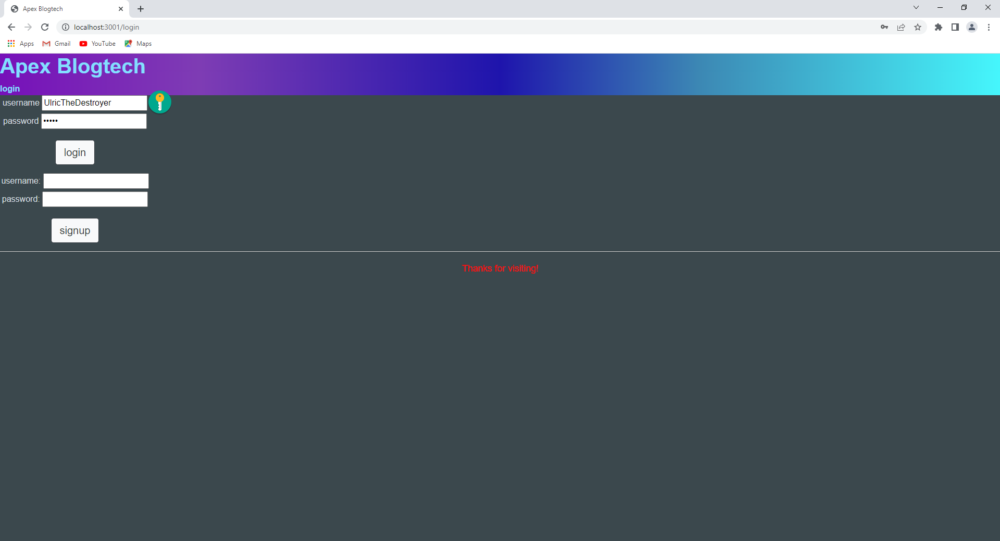

# Apex Blogtech.
The Apex Tech blog 

# Table of Contents

---

[Description](#Description)

[Installations](#Installations)

[Test](#Test)

[Link](#Link)

[Questions](#Questions)

# Description

Project designed to allow users to sign up, sign in, logout, create posts and add comments to their own or others posts. In which all data is stored in a database.

# Installation

   dotenv, express, sequelize, mysql2, bcrypt, express-session, express-handlebars, handlebars, connect-session-sequelize.

# Test

    npm install, npm start

# Link

https://apex-blogtech.herokuapp.com/

# Questions

---

## Contact me here:

## Author

     Roberto Gasparin

## [Github](https://github.com/box-monkey)

## [Email](mailto:jr.gasparin15@gmail.com)

#

